## Some Important Points

1. **Current Probe Direction is Wrong**  
In a simple voltage divider circuit it is found that when the current probe is placed on the Resistor it is showing the flow of current in negative direction. After searching online the following link is found which helps to fix the problem.  
[Current Probe Direction Wrong on Resistor](https://forum.allaboutcircuits.com/threads/direction-of-current-flow-in-ltspice.154700/)  
`
The summary is that in SPICE resistor also has polarity and to fix the problem, we need to rotate the resistor by 180 degrees.  
And as a circuit designer we must know the direction of current flow.  
`

2. **Exporting Data**  
LTSpice waveform is based on the data, and this can be exported to a text file using the File->Export Data to a Text file, and then this data be veiwed in a text editor and maybe useful for several other processing which is not supported by LTSpice.  
<!--  -->
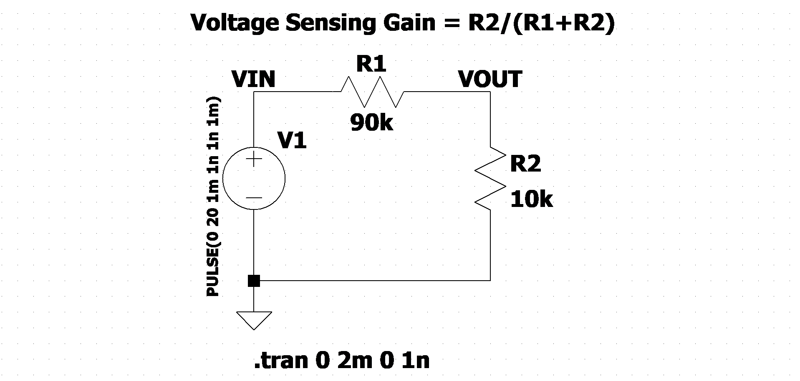  
The following is the data generated for the above schematic diagram, here **Transient Simulation Stop Time is 2 milli-second and time to start saving data is 0, while the Maximum Timestep is not specified**  
```
time  V(vin)  V(vout) I(R1)
0.000000000000000e+000  0.000000e+000 0.000000e+000 0.000000e+000
1.000000000000292e-003  5.828671e-006 5.828671e-007 5.828671e-011
1.000001000000000e-003  2.000000e+001 2.000000e+000 2.000000e-004
1.788999691298042e-003  2.000000e+001 2.000000e+000 2.000000e-004
1.999999000000000e-003  2.000000e+001 2.000000e+000 2.000000e-004
2.000000000000000e-003  2.000000e+001 2.000000e+000 2.000000e-004

```

3. **Instantaneous Power Consumption, Average Power of a Component**  
To see the Instantaneous Power Consumption of a component press the **ALT** key on that component. This will plot the power consumption of that component on the waveform.  
Similarly to view the average power consumption of a component, the above step needs to be followed and after that on the waveform, press the **CTRL + Left Mouse** to view the average power consumption of the same component.  

4. **RC Time Constant**  
The RC time constant, also called tau, the time constant (in seconds) of an RC circuit, is equal to the product of the circuit resistance (in ohms) and the circuit capacitance (in farads), i.e.  
`tau = RC [seconds]`  
It is the time required to charge the capacitor, through the resistor, from an initial charge voltage of zero to approximately 63.2% of the value of an applied DC voltage, or to discharge the capacitor through the same resistor to approximately 36.8% of its initial charge voltage.  
These values are derived from the mathematical constant e: 63.2% = 1-e^-1 and 36.8% = e^-1.  
We can cascade the RC filter to form a second order RC Low Pass Filter, a second order system with two poles gives more attenuation over high-frequency noise.  

5. **Saving Plot Settings**  
When the circuit is opened again in LTSpice the previous plot/waveform settings are gone, and to place the signals again will be a time consuming process. But there is an option in LTSpice to save the plot settings and this can be done by selecting the waveform window and then File->Save Plot Setting to a file, and next time when the circuit is opened the plot settings are saved.  

6. **Waveform Color Issues**  
* With .step  
It is observed that when using `.step` to plot the waveform for different values of a component, if the net is shared with some other net, then waveforms are plotted in same color. Example is give below.  
[Step Command Color Change Problem](https://electronics.stackexchange.com/questions/272572/ltspice-how-can-i-show-multiple-probes-with-waveforms-using-stepping-parameters)
[Step Command Color Change Problem](https://electronics.stackexchange.com/questions/627471/ltspice-waveform-color-change-as-step-command-is-added)


## Initial Condition for Transient Simulation
.ic imposes initial conditions (t=0) for the simulator, such as capacitor (C) voltage or inductor (L) current. The benefits of this are mentioned below.  
* Fix the uncertainties about the circuits such as flip-flops, oscillators etc.
* Solve the convergence problems
* Reduce the calculation time
* Make start-up condition similar to the real-world case.
```
Syntax:
.ic [V(<n1>)=<voltage>] [I(<inductor>)=<current]

Example:
.ic [V(in)=2] [V(out)=5] [V(vc)=1.8] [I(L1)=300m]
Here Vin = 2V, Vout = 5V, Vvc = 1.8V and IL1 = 300mA at t=0 i.e. initial condition for the simulation
```

## Parameter Sweeps (.step)
* There are two ways to examine a circuit in LTspice by changing the value of a particular parameter.  
  * Manually enter each value and then resimuae the circuit to view the respone, or
  * Use the `.step` command to sweep across a range of values in a single simulation run. (**Better Approach**)

* This command causes an analysis to be repeatedly performed while stepping the temperature, a model parameter, a global parameter or an independent source.
* The steps may be linear, logarithmic, or specified as a list of values.
* There are upto 3 parameters steps (i.e. upto 3 dimensions)

The following is a simple example with 2 step parameters.  
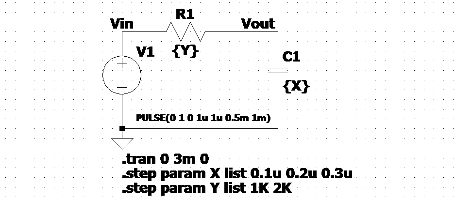  

As per above image we have two sweep parameters, one for capacitor and another for resistor, and we have three values for capacitor and two values for resistor, which makes the total count as two times three equals to six, which can be seen clearly from the following waveform.  
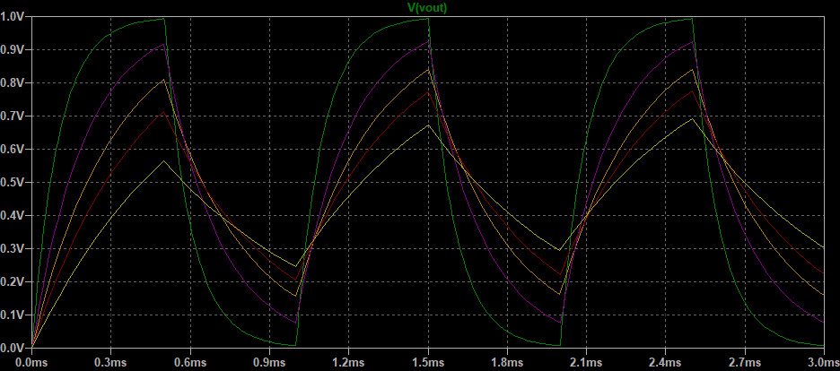  

And the following are the SPICE Error Logs, in this log the 6 steps are mentioned.  
```
.OP point found by inspection.
.step x=1e-007 y=1000
.step x=2e-007 y=1000
.step x=3e-007 y=1000
.step x=1e-007 y=2000
.step x=2e-007 y=2000
.step x=3e-007 y=2000

Date: Fri Jul 15 10:40:53 2022
Total elapsed time: 0.166 seconds.

tnom = 27
temp = 27
method = modified trap
totiter = 2272
traniter = 2272
tranpoints = 1137
accept = 1118
rejected = 19
matrix size = 3
fillins = 0
solver = Normal
Matrix Compiler1:       3 opcodes  0.0/[0.0]/0.0
Matrix Compiler2: 175 bytes object code size  0.0/0.0/[0.0]

```

**NOTE: Step Sweeps may be nested only upto 3-Levels Deep**  
Some Other examples of Step Sweeps are as below.  
* Example: `.step oct V1 1 20 5`  
  Step Independent Voltage Source V1 from 1 to 20 Logarithmically with 5 points per octave.  
* Example: `.step I1 10u 100u 10u`  
  Step Independent Current Source I1 from 10u to 100u in steps increment of 10u.  
* Example: `.step param RLOAD LIST 5 10 15`  
  Perform the simulation three times with the global parameter RLOAD being 5, 10, 15
* Example: `.step NPN 2N2222(VAF) 50 100 25`  
  Step NPN model parameter VAF (Forward mode Early Voltage) from 50 to 100 in steps of 25.  
* Example: `step temp -55 125 10`  
  Step the temperature from -55 degree to 125 degree celcius in 10 degree steps.  

The following is another Step Sweep example of 2nd order Low Pass Filtere where three parameters are sweeped.  

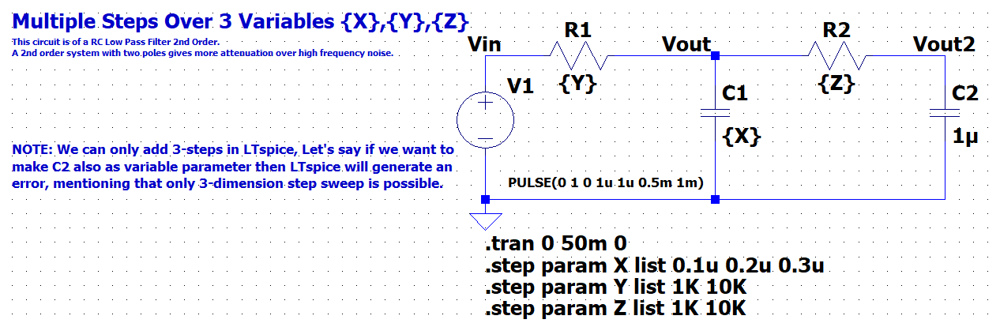  

And following is the waveform, of the above circuit with different sweeps.  

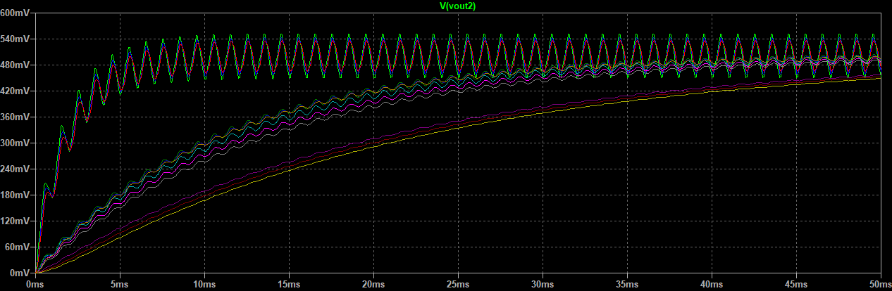  

We can also view legends by right clicking on the waveform and then selecting view --> step legend.  

## Measure (.meas) Average and Derivative
* MEAS is the abbreviation of Measure, this is the command used to access the measurements made possible by all simulation calculations.  
* The results is obtained in the file of SPICE Error Log (CTRL+L)  
```
Syntax: .MEAS[SURE] [AC|DC|OP|TRAN|TF|NOISE] <name>
+ [<FIND|DERIV|PARAM> <expr>]
+ [WHEN <expr> | AT=<expr>]]
+ [TD=<val1>] [<RISE|FALL|CROSS>=[<count1>|LAST]]

[AC|DC|OP|TRAN|TF|NOISE] := Simulation Type Declarations
<name> := Name of the variable for measurement
[<FIND|DERIV|PARAM> <expr>] := Treatment/Pre-Processing to <expr> before assigning it to the variable <name>
+ [WHEN <expr> | AT=<expr>]] := Condition or instant when the measurement must be made
+ [TD=<val1>] := Time Delay before making the measurement
[<RISE|FALL|CROSS>=[<count1>|LAST]] := Conditions about the selected measurement
```

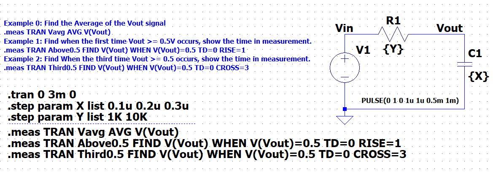  

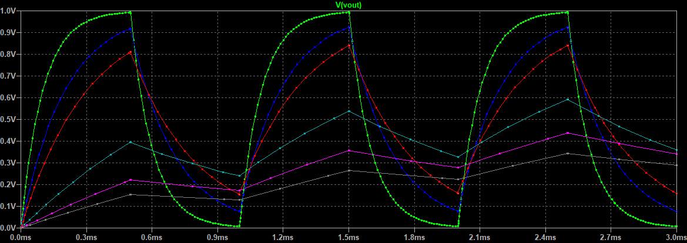  

_Example 0: Measure Average value of the output signal._  
```
.meas TRAN Vavg AVG V(Vout)

The SPICE Logs when the simuation run are as below.

Measurement: vavg
  step  AVG(v(vout))  FROM  TO
     1  0.500805      0     0.003
     2  0.495967      0     0.003
     3  0.485095      0     0.003
     4  0.381079      0     0.003
     5  0.273691      0     0.003
     6  0.210529      0     0.003

```  

_Example 1: Find When First Time Vout >= 0.5V, show the time measurement._  
```
.meas TRAN Above0.5 FIND V(Vout) WHEN V(Vout)=0.5 TD=0 RISE=1

The SPICE Logs when the simulation run are as below.
Measurement: above0.5
  step  v(vout)   at
     1  0.5       6.99916e-005
     2  0.5       0.00013957
     3  0.5       0.000208598
     4  0.5       0.00142086
     5  0         0
     6  0         0
```

_Example 2: Find When the third time Vout >= 0.5 occurs, show the time in measurement._  
```
.meas TRAN Third0.5 FIND V(Vout) WHEN V(Vout)=0.5 TD=0 CROSS=3

The SPICE Logs when the simulation run are as below. 
Measurement: third0.5
  step  v(vout)   at
     1  0.5       0.00106928
     2  0.5       0.00112377
     3  0.5       0.00115904
     4  0.5       0.0022997
     5  0         0
     6  0         0
```

## Piecewise Linear Sources (PWL)
* Picewise Liner Sources (PWL) functions are used to construct a waveform from a series of straight line segments connecting points defined by the user in LTspice (Linear Interpolation).
* Each point is a pair of a time <tx> and a value <vx>, and there are two typical syntax.  
  * The data can be represented as a pair of time and value.  
    `Syntax: PWL <t1> <v1> <....> <tn> <vn>`  

    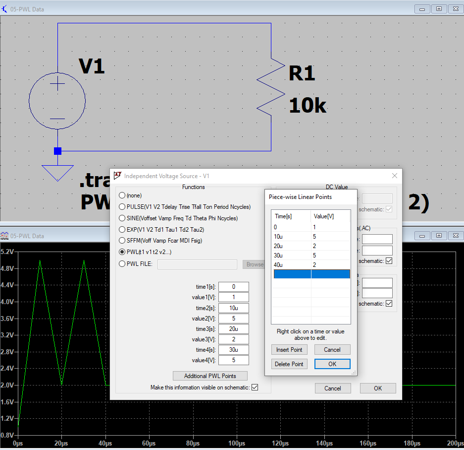  

  * Referring to a file (these are documented features).  
    `Syntax: PWL file=<name of the file>`  

    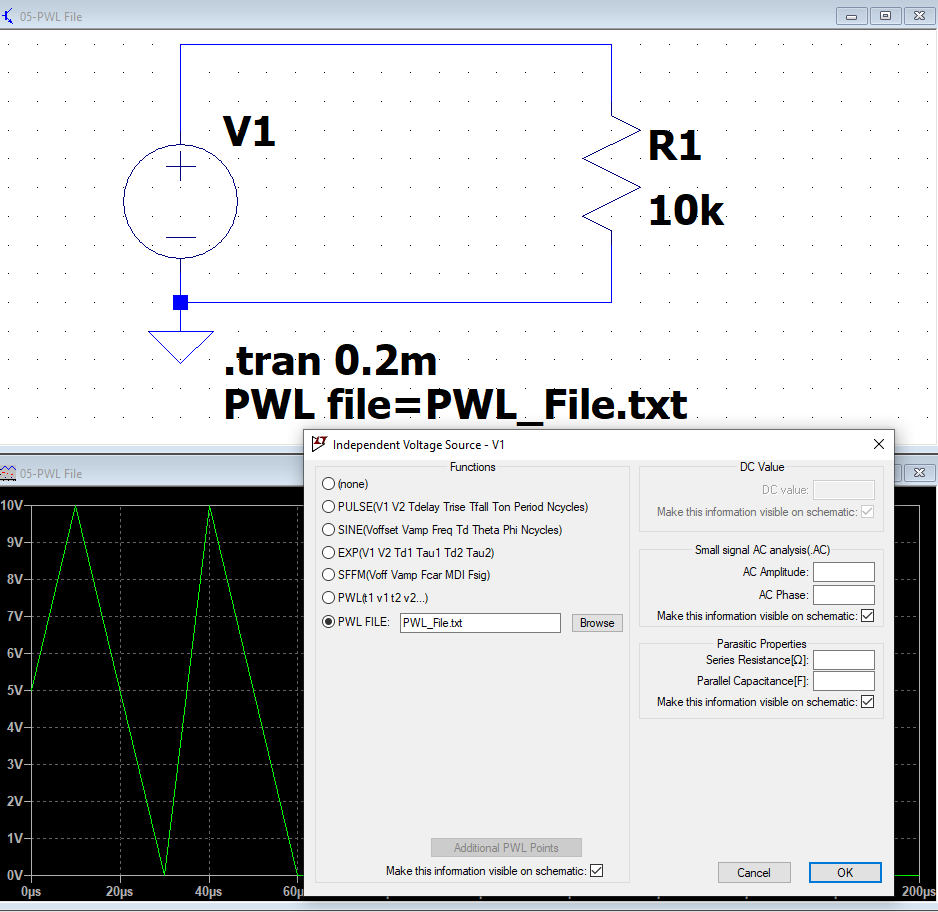  

* **Repeating Values**  
  * A list of data points or a file reference can be repeated a fixed amount of time <n> or forever.  
    `PWL REPEAT FOR <n> (|file specs|) ENDREPEAT`  
    `PWL REPEAT FOREVER <n> (|file specs|) ENDREPEAT`  
  * Example to repeat a sequence of value for 5 times  
    `PWL REPEAT FOR 5 (0 1 1 1 2 2 3 1) ENDREPEAT`  
    `PWL REPEAT FOR 5 (file=<name of file>) ENDREPEAT`  

## Arbitrary Sources
There are two arbitrary sources i.e. Arbitrary Voltage Source and Arbitrary Current Source.  
```
Syntax: Bnnn n001 n002 V=<expression> [ic=<value>]
        + [tripdv=<value>] [tripdt=<value>]
        + [laplace=<expression> [window=<time>]
        + [nfft=<number>] [mtol=<number>]]

        Bnnn n001 n002 I=<expression> [ic=<value>]
        + [tripdv=<value>] [tripdt=<value>] [Rpar=<value>]
        + [laplace=<expression> [window=<time>]
        + [nfft=<number>] [mtol=<number>]]

```
* Node Voltages and Differences, e.g. V(n1) and V(n1, n2)  
* Powerfull and versatile to support various operations, constants and functions.  
TODO


## DC Operating Points
TODO  

## DC Operating Points in Transient Simulation
TODO  

## DC Sweep(.dc) and Temperature
* This performs a DC analysis while sweeping the DC value of an independent source (voltage, current and temperature).  
* It is useful for computing the DC transfer function of a device, or plotting the current-voltage (I-V) characteristics curves of a device for model verification.  
* Syntax  
  ```
  .dc <srcnam> <Vstart> <Vstop> <Vincr> + [<srcnam2> <Vstart2> <Vstop2> <Vincr2>]  
  ```
  The <srcnam> is the source name, either an independent voltage or current source that is to be swept from <Vstart> to <Vstop> in <Vincr> step sizes. Here also the DC Sweep can be nested upto three values.  

**Temperature in LTspice**  
There are two keywords in LTspice for temperature one is `temp` and another is `tnom`.  
* `temp` : Default Value is 27 deg C. This is the default temperature for the circuit element instances that don't specify temperature.  
  This is an archaic form (old fashioned) for the step command for the temperature. It performs the simulation for each temperature listed.  
  The syntax is:  
  `.TEMP <T1> <T2> ....`  
  this is equivalent to the following `.step` command.  
  `.STEP TEMP LIST <T1> <T2> ...`  

* `tnom` : Default Value is 27 deg C. This is the default temperature at which device parameters were measured for models that don't specify this temperature.  

_Example : I-V Curve of Shottky Diode with Various Junction Temperature_  
The following is image from the datasheet of the schottky diode.  
  

The following is the schematic.  

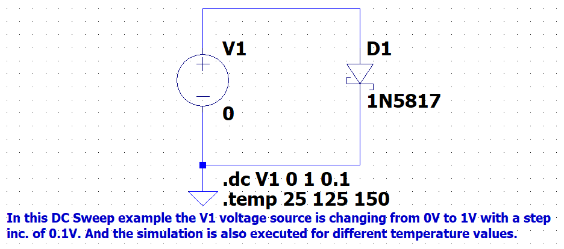  

And the following is the result from the simulation, and in comparison to the datasheet both are same (NOTE: the Y-Axis is Logarithmic).  

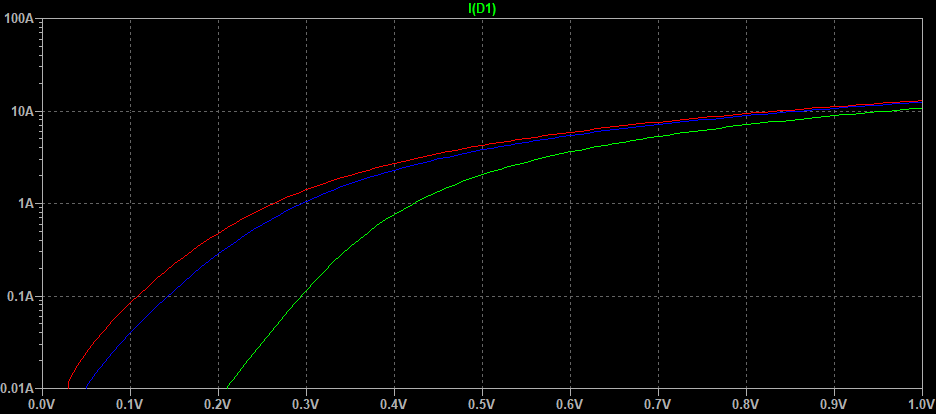  

So, here we used the command `.temp 25 125 150`, but the same results can be obtained by using the following ways.  
1. Using `.step` command  
  `.step temp 25 125 150`  
2. Using `.dc` Sweep and modifying the 2nd Source  
  `.dc V1 0 1 0.01 temp list 25 125 150`  

In general for the above used diode the temperature coefficient is negative i.e. dV/dT < 0 where V is voltage and T is temperature.  
* Consider the temperature coefficient of the semiconductor diode's forward voltage drop, which is dV/dT. This temperature coefficient is negative, meaning that the voltage across a diode or a base-emitter junction for a particular current decreases as we heat up the device. The negative temperature coefficient is the basis of thermal runway, in which a diode or transistor driven by a fixed voltage gets hotter and passes more and more current until it over-heats and fails.  
* Diodes can't be easily connected in parallel, because of their negative temperature coefficients: an imbalance in device characteristics may cause one diode to conduct more than the others. The diode becomes hotter, which causes it to conduct even more of the total current. In consequence, the current doesn't divide evently between the parallel devices, and the current rating of the devices may be exceeded.  
* This is the root cause of thermal runway.  

## Transfer Function (.TF): Find the DC Small Signal Transfer Function
* This is an analysis mode that finds the DC Small Signal Transfer Function of a node voltage or branch current due to small variations of an independent source.  
* Output is a dialog box giving the Low Frequency Gain and Input and Output Resistance of a Circuit.  
* Syntax:  
  ```
  .TF V(<node>)[,<ref>] <source>   
  .TF I(<voltage source) <source>  
  Examples:  
  .TF V(out) Vin  
  .TF V(5,3) Vin  
  .TF I(Vload) Vin  
  ```

_Example 1: Transfer Function of a Voltage Divider_  

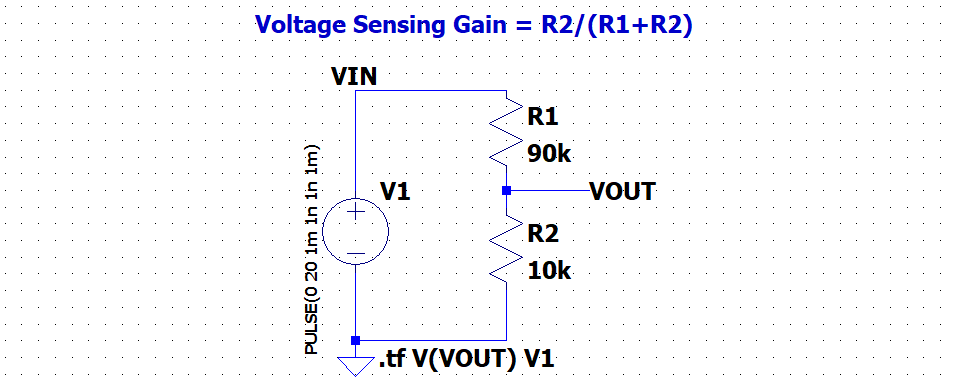  

The results of the simulation is as below.  
```
       --- Transfer Function ---

Transfer_function:              0.1     transfer
v1#Input_impedance:             100000  impedance
output_impedance_at_V(vout):    9000    impedance
```

Theoretical Calculations:  
DC Voltage Gain   = `Vout/Vin = 1/10`  
Input Impedance   = `R1 + R2 = 90k + 10k = 100k`  
Output Impedance  = `R1 || R2 = 1/R1 + 1/R2 = (R1 * R2)/(R1 + R2) = (90k * 10k) * (10k + 90k) = 900k/100k = 9k`  

## Fourier Theorem and Bode Plot  
**Introduction of Frequency Domain Analysis**  
* Previously all the analysis were time-domain analysis and DC analysis, now Frequency Domain Analysis will be started.  
* The following keywords are most important and are interchangeable(in most cases).  
  * Frequency Domain Analysis:  
    The frequency domain refers to the analysis of mathematical functions or signals with respect to frequency, rather than time.  
  * Small-Signal Analysis:  
    Linearization of circuit characteristics at certain DC-bias point, with small-magnitude time-varying current and voltage as the variable.  
  * AC Analysis  
    AC means alternative-current signals in frequency domain.  

* **Why AC Analysis is important?**  
  * Because it gives a whole new dimension/insight of the system in frequency.  
  * A system in response to a stimulus, showing the dynamics of a system.  
  * For Example: inductor and capacitor are frequency dependent.  

* **Why AC Analysis is important?**  
  **Fourier Theorem**: A mathematical theorem stating that a Periodic Function f(x) which is reasonably continous may be expressed as the sum of a series of sine or cosine terms (called the Fourier series), each of which has a specific Amplitude and Phase Coefficients knows as Fourier Coefficients.   

* **Introduction to Bode Plot**  
  Assume we record the magnitude and phase change of the function of Vout/Vin, at each single frequency, we can make a Bode Plot.  
  ```
  Gdb = 20.log10(Vout/Vin)dB  
  Gdb = 20.log10VoutdB - 20.log10VindB  
  ```

**Real World Capacitor**  
TODO  

